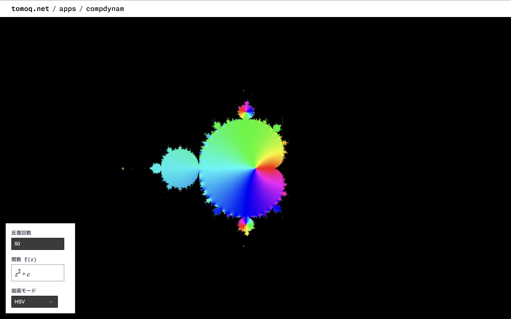

# 2D Tiling

2 次元平面充填を描画するページ．

リンク: [https://www.tomoq.net/apps/2d-tiling](https://www.tomoq.net/apps/2d-tiling)

## 操作方法

## 今後の実装予定

- タイリングの描画

- $\kappa, \alpha, \beta, \gamma, a, b, c$ を計算

- $m_{01}, m_{12}, m_{20} \in\left\{2,3,4,\ldots\right\}$ の入力

## 参考

- [Wythoffian construction diagram](https://en.wikipedia.org/wiki/File:Wythoffian_construction_diagram.svg)
