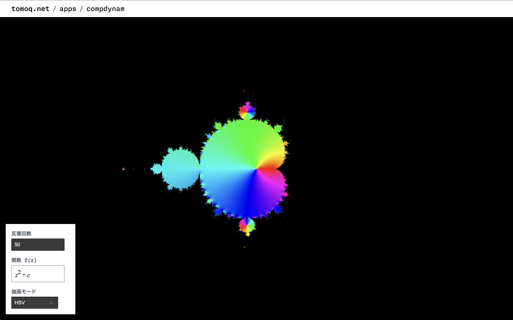

# Graph 2D

2 次元グラフを描画するページ．

リンク: [https://www.tomoq.net/apps/graph-2d](https://www.tomoq.net/apps/graph-2d)

## 操作方法(共通)

- 左下のフォームで反復回数と初期値，関数を設定する(入力例は[こちら](#入力ガイド))
- パレットアイコンのボタンで描画モードを切り替える
- 家アイコンのボタンで表示領域をリセットする

## 操作方法(PC)

- キャンバス上でのマウスドラッグで移動
- キャンバス上でのスクロールでズームイン・アウト

## 操作方法(スマホ)

- キャンバス上でのタッチドラッグで移動
- キャンバス上でのピンチでズームイン・アウト

## 入力ガイド

初期値や関数で使用できる入力は以下の通り．

### 基本的な変数と定数

- `x` - 横軸変数
- `y` - 縦軸変数
- `t` - 時間パラメータ
- `\pi ` または `π` - 円周率
- `e` - 自然対数の底

### 基本演算

- `+`, `-`, `*`, `/` - 四則演算
- `^` - べき乗
- `|x|` - 絶対値

### 関数

- `sin`, `cos`, `tan`, `cot`, `sec`, `csc` - 三角関数
- `sinh`, `cosh`, `tanh`, `coth`, `sech`, `csch` - 双曲線関数
- `exp` - 指数関数
- `ln` - 自然対数関数

## 今後の実装予定

- 座標を確認できるようにする

- 反復番号 $n$ を数式文字列に使用できるようにする

- スマートフォンでのピンチ操作テスト

- 多倍精度浮動小数点数の実装([前提条件 🔗](/README.md#今後の実装予定))

- GPGPU の実装([前提条件 🔗](/README.md#今後の実装予定))

  初期からの実装(1 フレームごとに指定した反復回数分計算する方法)に加えて，キャンバスと同じサイズのバッファ(符号付き浮動小数点)を別途 2 つ用意して，ダブルバッファリングの要領でより小さな負荷で計算できる方法を実装する．`ControlButtons`の計算モード切り替えボタンを押すと，計算モードが切り替わるようにする．
