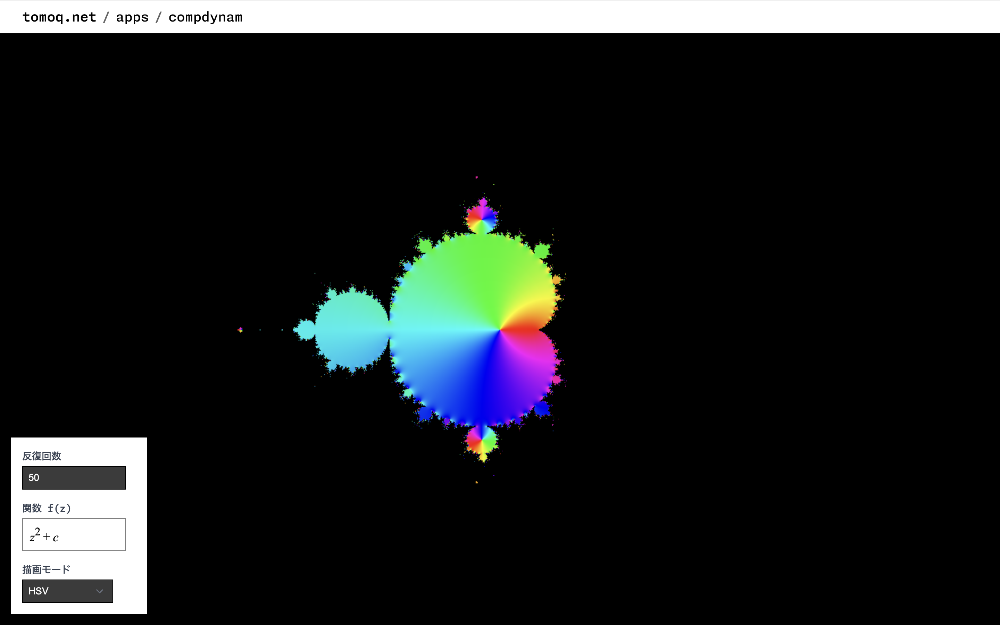

# Polychora

4 次元一様多胞体を観察するページ．

リンク: [https://www.tomoq.net/apps/polychora](https://www.tomoq.net/apps/polychora)

<!--  -->

## 操作方法(共通)

- 左下のフォームでコクセターディンキン図を設定する

## 操作方法(PC)

## 操作方法(スマホ)

## やりたいこと

- [ ] feat: 焦点距離を調整できるようにする
- [ ] feat: 双対多胞体描画機能
- [ ] feat: ノード「s」の対応
- [ ] feat: `solidframe` のジオメトリ生成における面の向きの修正
- [ ] feat: UI の改善
  - [ ] ジオメトリ生成方法選択
  - [ ] 一様多胞体の統計情報
  - [ ] コクセターディンキン図入力方法の切り替え
